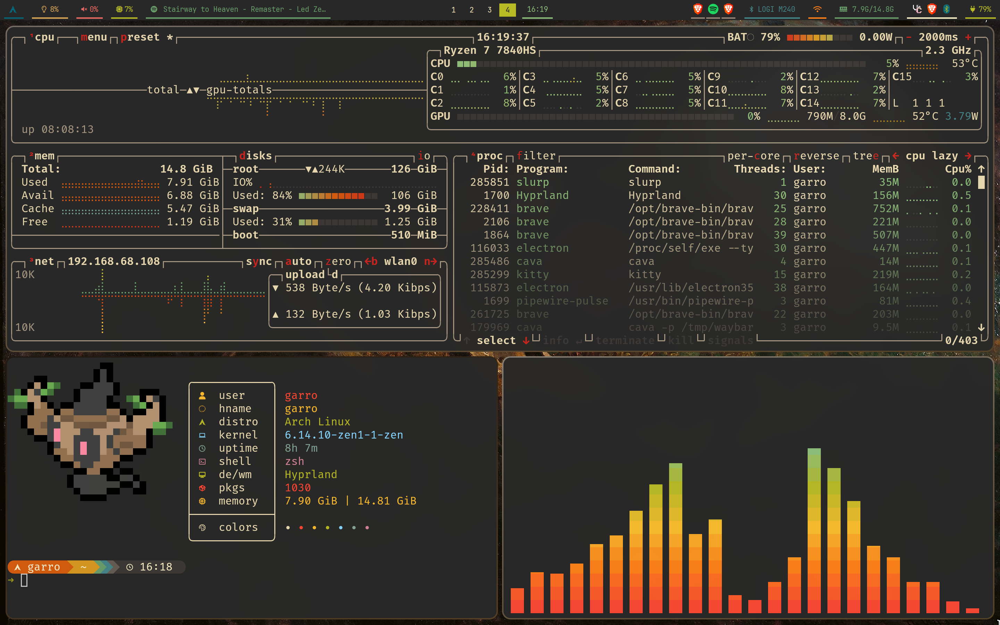
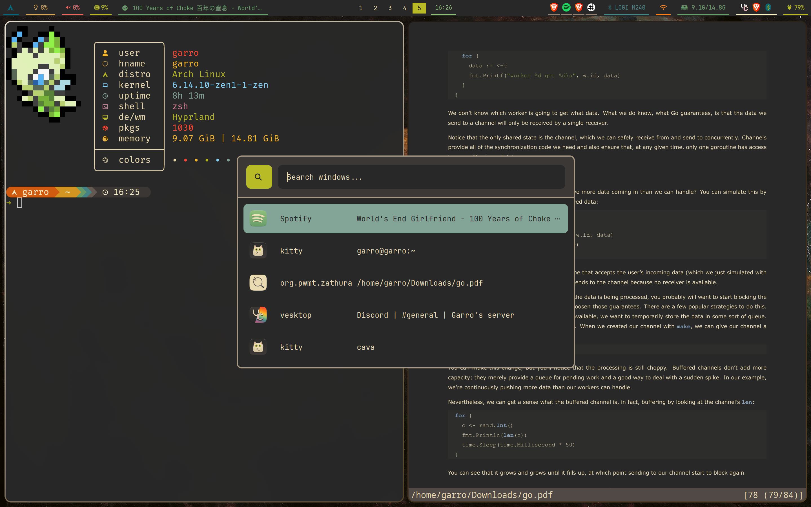
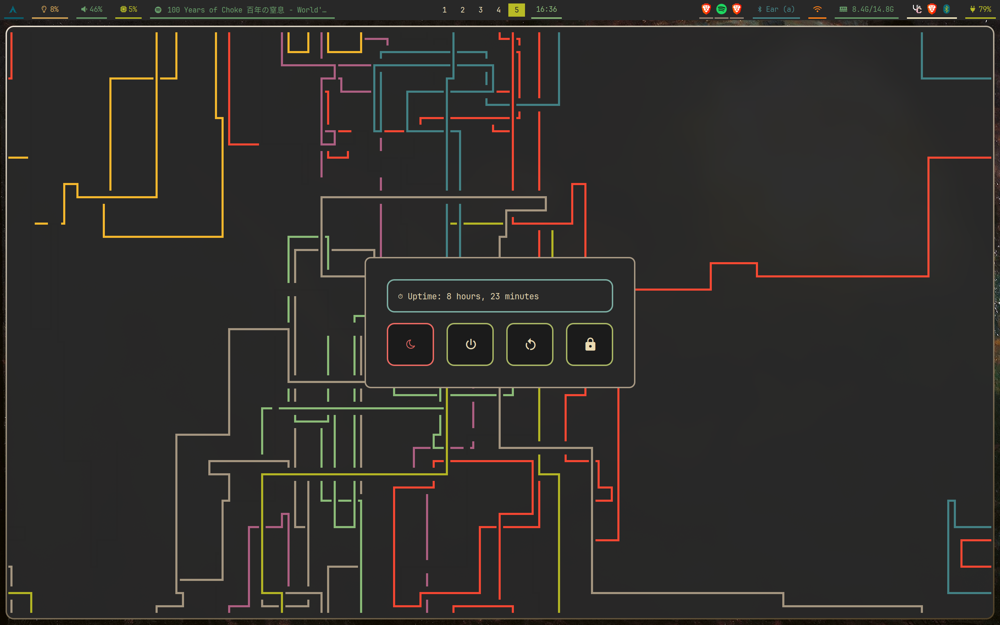
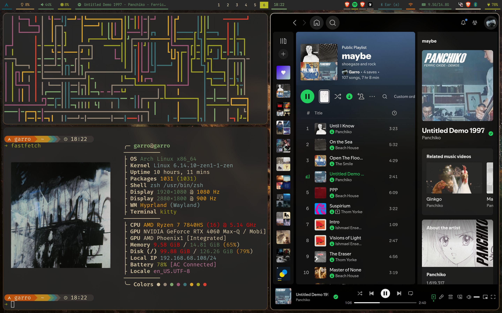
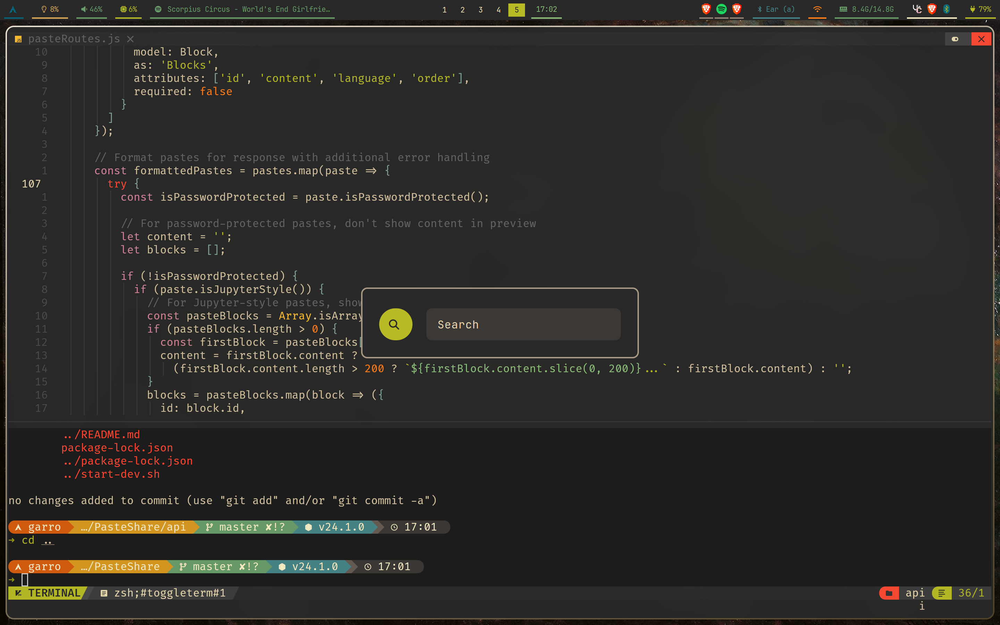

# Gruvbox Hyprland Theme Configuration

## Screenshots













## What's Included

- **📊 Waybar** - Status bar with all essential modules and gruvbox styling
- **🖥️ Kitty** - Terminal emulator with gruvbox color scheme
- **🚀 Rofi** - Application launcher and menu system with gruvbox theme
- **⚡ Fastfetch** - System information display
- **🎵 Cava** - Audio visualizer with gruvbox colors
- **🐚 Zsh** - Shell configuration with oh-my-zsh, starship prompt, custom nitch++ with pokemon display

## Installation

The configuration assumes you have the following applications installed:

### Core Applications
- `waybar` - Status bar
- `kitty` - Terminal emulator  
- `rofi` - launcher
- `fastfetch` - System info
- `cava` - Audio visualizer

### Shell and Utilities
- `zsh` - Shell
- `oh-my-zsh` - Zsh framework
- `zsh-vi-mode` - Zsh extension for vim bindings
- `starship` - Shell prompt
- `krabby` - Pokemon display written in rust
- `nitch++` - System info display

### System Tools (used in aliases)
- `pacman`/`yay` - Package managers
- `iwmenu` - Network management
- `blueman-manager` - Bluetooth management
- `pavucontrol` - Audio control
- `btop` - System monitor

### Installation Steps

1. **Backup your existing configurations**
   ```bash
   mkdir ~/config-backup
   cp -r ~/.config/waybar ~/config-backup/ 2>/dev/null || true
   cp -r ~/.config/kitty ~/config-backup/ 2>/dev/null || true
   cp -r ~/.config/rofi ~/config-backup/ 2>/dev/null || true
   cp -r ~/.config/fastfetch ~/config-backup/ 2>/dev/null || true
   cp -r ~/.config/cava ~/config-backup/ 2>/dev/null || true
   cp ~/.zshrc ~/config-backup/ 2>/dev/null || true
   ```

2. **Clone this repository**
   ```bash
   git clone https://github.com/GarroNinja/gruvbox-hyprland.git
   cd gruvbox-hyprland
   ```

3. **Copy configurations to your system (not recommended, review and copy the contents of each file for better integration)** 
   ```bash
   # Copy application configs
   cp -r waybar/* ~/.config/waybar/
   cp -r kitty/* ~/.config/kitty/
   cp -r rofi/* ~/.config/rofi/
   cp -r fastfetch/* ~/.config/fastfetch/
   cp -r cava/* ~/.config/cava/
   
   # Copy shell configs
   cp zsh/.zshrc ~/.zshrc
   cp zsh/starship.toml ~/.config/starship.toml
   ```

4. **Restart your session or reload configurations**
   ```bash
   # Restart Waybar
   killall waybar && waybar &
   
   # Restart shell or source new config
   source ~/.zshrc
   ```

## Configuration Details

### Waybar Features
- Clean gruvbox-themed status bar
- Network, Bluetooth, Audio, System monitoring modules
- Custom Cava audio visualizer integration
- Custom scripts for enhanced functionality

### Kitty Terminal
- Gruvbox color scheme
- Optimized font settings
- Performance configurations

### Rofi Launcher
- Multiple gruvbox-themed styles
- Custom launchers for different use cases
- Power menu, application launcher, window switcher, custom them iwmenu with gruvbox theme

### Fastfetch
- Custom logo and system information display
- Gruvbox color coordination
- Clean, informative output and tiled mode responsive

### Cava Audio Visualizer
- Gruvbox color palette
- Multiple shader options
- Smooth audio visualization

### Zsh Configuration
- oh-my-zsh with useful plugins
- Starship prompt with gruvbox theme
- Comprehensive aliases for system management
- Pokemon + system info display on terminal startup (nitch++ and krabby custom scriptt)

## Customization

Feel free to modify any configurations to suit your preferences. The color schemes are consistent across all applications, but you can adjust them by editing the respective configuration files.

### Key Color Variables (Gruvbox Palette)
- Background: `#282828`
- Foreground: `#ebdbb2`
- Dark: `#1d2021`
- Red: `#cc241d`
- Green: `#98971a`
- Yellow: `#d79921`
- Blue: `#458588`
- Purple: `#b16286`
- Aqua: `#689d6a`
- Orange: `#d65d0e`

## Troubleshooting

If you encounter issues:

1. Ensure all dependencies are installed
2. Check that file permissions are correct
3. Verify Waybar modules are working: `waybar -c ~/.config/waybar/config.jsonc`
4. For zsh issues, check plugin installations and paths

## Contributing

Feel free to submit issues, fork the repository, and create pull requests for any improvements.

## Credits

- Gruvbox color scheme by Pavel Pertsev
- Community configurations and scripts from various contributors

## License

This configuration is provided as-is. Feel free to use and modify according to your needs.


